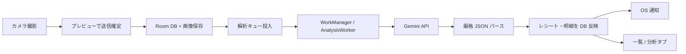

# kakeibo-app

**レシートを撮るだけで家計簿が完成する、Android向け個人用家計簿アプリ。**

Kotlin + Jetpack Compose で構築し、Gemini API によるマルチモーダル解析でレシート画像を構造化データへ変換します。1か月以上の実利用を経て、手入力の家計簿アプリからの「3日で挫折」という課題に対する実践的な解を検証しています。

---

## プロダクト概要

毎回の買い物のたびに「金額・品目・店舗・カテゴリ」を手入力する負担をなくすため、**レシート撮影 → AI解析 → 自動登録** という流れに特化した家計簿アプリを開発しました。

設計の核は **「撮影体験の摩擦をゼロに近づける」** ことです。起動と同時にカメラが開き、撮影後はプレビューで送信を確定するだけで解析キューへ投入されます。解析はバックグラウンドで非同期に行われ、完了後は一覧・分析タブへ自動反映されます。

本プロジェクトでは、要件定義から実装・デバッグまで **Cursor（AI）を活用した AI駆動開発** を採用し、設計判断とプロンプト設計を上流から主導しながら高速に形にしました。

---

## 開発の背景と動機

社会人になり収入が増えたことをきっかけに家計簿を付け始めましたが、一般的な家計簿アプリは **わずか3日で挫折** しました。

原因を分析すると、自分の消費行動（頻繁な小さな買い物）と、アプリの入力フロー（毎回の手入力）が致命的に相性が悪いことが分かりました。

そこで次の体験を目標に開発を開始しました。

```
アプリ起動 → シャッター → 送信確定
```

この3操作で記録が完了し、あとは AI が解析・分類・集計まで担う。**実際に1か月以上の日常利用を継続**しており、手入力のストレスから解放されることを確認しています。

---

## 主な機能（実装済み）

| 領域 | 内容 |
|------|------|
| **撮影 UX** | 起動＝即カメラ、送信前プレビュー、確定後は即カメラへ復帰 |
| **AI 解析** | Gemini REST API + 厳格 JSON スキーマ（`responseJsonSchema`）で店舗名・日時・明細・カテゴリ・必須度を抽出 |
| **解析キュー** | WorkManager による1件ずつの順次処理、完了/失敗の OS 通知 |
| **一覧・詳細** | レシート単位の一覧、明細行表示、必須/裁量バッジ（`necessityScore` 金額加重平均） |
| **分析** | 月次の必須 vs 裁量比率、無駄遣い候補 TOP、月切替 |
| **要確認フロー** | 低信頼（`confidence < 0.7`）時のみ修正画面へ誘導 |
| **手入力** | レシート以外の支出を手動追加 |
| **バックアップ** | JSON ファイルの手動エクスポート/復元（SAF）、月次リマインド |
| **セキュリティ** | Gemini API キーは EncryptedSharedPreferences で端末内保管（リポジトリ非コミット） |

### 画面構成（ボトムタブ 5つ）

一覧 / 分析 / **カメラ（中央）** / 通知 / 設定

---

## 技術スタック

| カテゴリ | 採用技術 |
|----------|----------|
| 言語 | Kotlin |
| UI | Jetpack Compose + Material 3 + Navigation Compose |
| カメラ | CameraX |
| 永続化 | Room（SQLite） |
| バックグラウンド | WorkManager |
| HTTP | OkHttp（Gemini REST API 直呼び出し） |
| 画像 | Coil、JPEG 圧縮 |
| ファイル I/O | Storage Access Framework（JSON バックアップ） |
| AI | Google Gemini API（マルチモーダル + 構造化 JSON 出力） |

> **アーキテクチャの前提**: サーバーレス構成です。Ktor 等のバックエンドは持たず、Android アプリから Gemini API を直接呼び出します。

---

## データの流れ



1. ユーザーがレシートを撮影し、プレビュー画面で送信を確定
2. 画像とメタデータをローカル DB に保存し、`analysis_queue` へ投入
3. `AnalysisWorker` がネットワーク接続時に Gemini へ画像を送信
4. 返却 JSON をスキーマ検証・パースし、明細行（カテゴリ・必須度スコア付き）として保存
5. 低信頼時は `needsReview` フラグを立て、通知タブから修正へ誘導
6. 集計は分析タブで月次の必須/裁量を可視化

---

## ポートフォリオとしてのアピールポイント

### 1. UX ファーストの要件設計

「起動から撮影までの動線を最速にする」を最優先に据え、無駄な画面遷移や設定を削ぎ落としました。1か月の実利用フィードバックでも、**起動 → 撮影の体験は想定どおり**と評価されています。

### 2. プロンプトエンジニアリングによる構造化 OCR

従来型 OCR ライブラリではなく、Gemini のマルチモーダル能力と `responseJsonSchema` を組み合わせ、しわや傾きのあるレシートからも **指定フォーマットの JSON を安定して抽出** する設計を行いました。カテゴリ体系・必須度スコア（`necessityScore`）の付与まで AI に任せ、無駄遣いの可視化につなげています。

### 3. AI 駆動開発とドキュメント駆動の実践

コード生成だけでなく、**要件・計画・デバッグ手順を先に文書化**し、AI との対話で反復改善する開発スタイルを採用しました。リポジトリ内のドキュメントは設計判断の根拠と開発プロセスの記録として公開しています。

| ドキュメント | 内容 |
|-------------|------|
| [`docs/REQUIREMENTS.md`](docs/REQUIREMENTS.md) | 要件定義（UX・データモデル・カテゴリ体系） |
| [`docs/IMPLEMENTATION_PLAN_REVISED_2026-07-11.md`](docs/IMPLEMENTATION_PLAN_REVISED_2026-07-11.md) | 実装計画（Phase 7 途中・手動バックアップ移行・最新） |
| [`docs/IMPLEMENTATION_PLAN_REVISED_2026-06-16.md`](docs/IMPLEMENTATION_PLAN_REVISED_2026-06-16.md) | Phase 7 着手時の計画（アーカイブ） |
| [`docs/IMPLEMENTATION_PLAN_REVISED_2026-06-12.md`](docs/IMPLEMENTATION_PLAN_REVISED_2026-06-12.md) | Phase 6 定義（完了・アーカイブ） |
| [`docs/IMPLEMENTATION_PLAN_REVISED_2026-04-26.md`](docs/IMPLEMENTATION_PLAN_REVISED_2026-04-26.md) | Phase 1〜5 の到達点・完了状況 |
| [`docs/DEBUGGING_GUIDE.md`](docs/DEBUGGING_GUIDE.md) | 実機デバッグ・再現性確保の手順 |
| [`docs/EXTERNAL_SETUP.md`](docs/EXTERNAL_SETUP.md) | Gemini API の外部サービス設定 |
| [`docs/BACKUP_MANUAL_MIGRATION_PLAN.md`](docs/BACKUP_MANUAL_MIGRATION_PLAN.md) | 手動 JSON バックアップへの移行計画 |
| [`docs/ONBOARDING_IMPLEMENTATION_PLAN.md`](docs/ONBOARDING_IMPLEMENTATION_PLAN.md) | Phase 7.1 オンボーディング実装計画 |
| [`docs/daily/`](docs/daily/) | 開発日報 |

---

## 開発環境

- **IDE**: Android Studio
- **対象 OS**: Android 8.0+（`minSdk 26`）
- **開発端末**: Pixel 8a（ワイヤレスデバッグ）
- **ビルド**: Gradle（Kotlin DSL）

### セットアップの概要

1. リポジトリをクローン
2. Android Studio でプロジェクトを開き、実機またはエミュレータで Run
3. 初回起動時に **Gemini API キー** をアプリ内で入力（端末内に暗号化保存）
4. 月1回程度、設定から **JSON をエクスポート** して PC やクラウドに保管（一覧タブで月次リマインドあり）

### 秘密情報の扱い

- API キー・OAuth クレデンシャルは **リポジトリにコミットしない**
- `.gitignore` で `local.properties` 等を除外済み

---

## ロードマップ

実装計画（[`docs/IMPLEMENTATION_PLAN_REVISED_2026-07-11.md`](docs/IMPLEMENTATION_PLAN_REVISED_2026-07-11.md)）に基づく、直近の改善項目です。

### Phase 6: 実利用フィードバック対応（完了）

- [x] ナビゲーション修正、通知アイコン、手動再送信、修正画面本格化、necessityScore 基準明確化

### Phase 7: 実利用で顕在化したギャップ

- [x] **APIキー未設定時の送信ガード** — プレビュー + Worker
- [x] **手動 JSON バックアップ** — Drive 連携廃止、SAF エクスポート/復元、月次リマインド
- [x] **初回オンボーディング** — ウィザード・権限・APIキー誘導（ブラッシュアップは後回し）

### Phase 5 残タスク

- [ ] 解析状態の可視化統一（一覧 / 詳細 / 通知タブで同一ラベル）
- [ ] 通知履歴の永続化（OS 通知見逃し対策）
- [ ] Gemini JSON 閲覧体験の改善、プロンプト継続チューニング

### 将来検討

- [ ] オフライン対応（撮影 → キュー保持 → 後解析）
- [ ] 送信前プレビューの回転 / トリミング
- [ ] 店名・商品名の検索
- [ ] バックアップ暗号化

---

## ライセンス

MIT License — 詳細は [LICENSE](LICENSE) を参照
