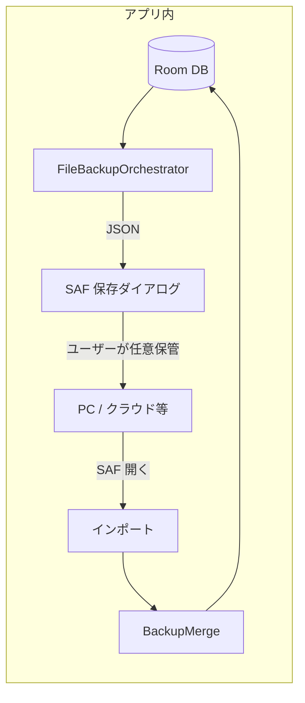

# バックアップ方式の移行計画 — Drive 廃止 → 手動 JSON ファイル

> **ステータス**: 実装済み（2026-07-11）  
> **作成日**: 2026-07-11  
> **前提**: 個人利用。コア体験（撮影 → AI 解析 → 一覧/分析）に開発リソースを集中する。

---

## 1. 背景と判断

### なぜ Drive をやめるか

| 観点 | 内容 |
|------|------|
| 利用形態 | 個人利用。複数端末の自動同期は不要 |
| 運用コスト | OAuth / SHA-1 / 403・404 / 再ログイン / manifest v2 の実機検証が重い |
| モチベーション | コア以外の「間接的な保全」に時間を取られ、開発が停滞した |
| ポートフォリオ | 未完成の Drive より、**動く手動バックアップ + 明確なスコープ判断**の方が説明しやすい |
| 既存資産 | JSON エクスポート/マージの中核（`data/backup/`）はそのまま活かせる |

### 代替方針

- アプリ内の **Google Drive 連携を廃止**
- 設定画面から **JSON を端末の任意フォルダへエクスポート / そこから復元（マージ）**
- ユーザーが好きな場所（PC、Google Drive アプリ、クラウドストレージ）へ **手動でコピー**する運用
- 日次自動バックアップ・月初アーカイブ・manifest v2 は **実装しない**

### git 履歴について

Drive 実装（v1 上書き → v2 manifest）は **コミット履歴に残る**。面接・README では「試行後にスコープ整理」と説明可能。コード削除は「諦め」ではなく **意図的な簡素化**として位置づける。

---

## 2. 移行後の姿（サマリー）



| 項目 | 移行前 | 移行後 |
|------|--------|--------|
| 保全の主体 | Drive appDataFolder（自動 24h + 手動） | ユーザー手動（エクスポート JSON） |
| 認証 | Google Sign-In + `drive.appdata` | **なし** |
| ファイル形式 | manifest + 複数 snap-* / 旧 current-month 等 | **単一 JSON**（`FULL_SNAPSHOT`） |
| 復元 | Drive からマージ | 選択した JSON からマージ |
| 開発用退避 | `scripts/dev-pull-device-data.ps1` | **継続**（adb で DB 直抜き） |

---

## 3. 削除するもの

### 3.1 Kotlin ソース（丸ごと削除）

| パス | 役割 |
|------|------|
| `app/.../data/drive/DriveBackupOrchestrator.kt` | Drive バックアップ/復元オーケストレーション |
| `app/.../data/drive/DriveBackupRepository.kt` | Drive REST API |
| `app/.../data/drive/GoogleSignInHelper.kt` | Google Sign-In |
| `app/.../data/drive/BackupManifest.kt` | manifest v2 スキーマ |
| `app/.../data/drive/BackupSafetyGuard.kt` | manifest 参照の安全ガード（Drive 専用） |
| `app/.../data/drive/DriveBackupUserMessages.kt` | Drive 向けエラー文言 |
| `app/.../data/drive/DriveHttpException.kt` | HTTP エラー型 |
| `app/.../data/drive/LocalBackupEmptyException.kt` | ※概念は `data/backup/` へ移設 |
| `app/.../data/drive/BackupRegressionException.kt` | ※概念は `data/backup/` へ移設 |
| `app/.../data/work/DriveBackupWorker.kt` | 24h 周期 Worker |
| `app/.../data/work/DriveBackupScheduler.kt` | PeriodicWork 登録 |
| `app/.../data/prefs/DriveBackupPrefs.kt` | Drive 用 DataStore |

**削除後**: `data/drive/` パッケージは空になるためディレクトリごと削除。

### 3.2 既存ファイルから削除する部分

| パス | 削除内容 |
|------|----------|
| `MainActivity.kt` | `DriveBackupScheduler.schedule()` の import と `LaunchedEffect` 内呼び出し |
| `SettingsScreen.kt` | 「Googleドライブ」セクション全体（ログイン/ログアウト、Drive バックアップ/復元、再ログインダイアログ、空DB復元プロンプト） |

### 3.3 Gradle 依存（削除候補）

| 依存 | 理由 |
|------|------|
| `play-services-auth` | Google Sign-In 専用 |
| `androidx.datastore.preferences` | `DriveBackupPrefs` のみ使用の場合 |

**残す依存**

| 依存 | 理由 |
|------|------|
| `androidx.work.runtime.ktx` | `AnalysisWorker`（解析キュー） |
| `gson` | `BackupJsonCodec` |
| `okhttp` | Gemini API |

### 3.4 廃止する機能・挙動

- ログイン時の Drive 接続・自動バックアップスケジュール
- manifest 更新、snap-* 作成、prune、月初アーカイブ
- `CURRENT_MONTH` / `ARCHIVE_MONTH` の **Drive 向け分割アップロード**
- Drive 403/404 エラー処理、再ログイン導線
- `EXTERNAL_SETUP.md` の Drive API / OAuth / SHA-1 手順（**削除または「過去の試行」へ移動**）

### 3.5 意図的に実装しないこと

- アプリからの Google Drive 直接アップロード
- バックグラウンドでの定期エクスポート
- 複数 JSON ファイルの世代管理（manifest）
- レシート画像のバックアップ（従来どおり取引データのみ）
- 旧 Drive バックアップ形式との互換読み込み（テストデータのみのため）

---

## 4. 残すもの

### 4.1 バックアップ中核（そのまま利用）

| パス | 役割 |
|------|------|
| `data/backup/BackupJsonModels.kt` | `KakeiboBackupFile`、DTO、`BackupExportTypes` |
| `data/backup/BackupJsonCodec.kt` | JSON シリアライズ/デシリアライズ |
| `data/backup/BackupExportBuilder.kt` | DB → JSON 構築、日付ウィンドウ判定 |
| `data/backup/BackupMerge.kt` | `updatedAt` 優先マージ、`mergeIntoDb` |

### 4.2 DB 層

| パス | 内容 |
|------|------|
| `ReceiptDao.listAllReceiptsForExport()` | フルエクスポート用 |
| `ReceiptDao.countActiveReceipts()` | 安全ガード用 |
| `ReceiptDao.replaceReceiptAndItems()` | マージ時の置換 |
| `Entities.backupRevision` / マイグレーション | マージ競合解決用 |

### 4.3 開発用（アプリ外）

| パス | 役割 |
|------|------|
| `scripts/dev-pull-device-data.ps1` | adb で DB + 画像を `backups/dev/` へ退避 |
| `backups/`（gitignore） | PC 上の実データ退避 |

### 4.4 安全ガードの「概念」（リファクタして残す）

Drive 専用実装は捨てるが、以下の教訓は手動フローに移植する。

| 概念 | 移行後の適用 |
|------|----------------|
| 空 DB での上書き防止 | **エクスポート**: ローカル active 0 件なら拒否（または強い警告） |
| 件数退行の警告 | **インポート**: JSON の active 件数がローカルより大幅に多い場合は確認ダイアログ（復元意図の確認） |
| マージ | 既存の `BackupMerge`（`updatedAt` 優先）を継続 |

例外クラス `LocalBackupEmptyException` / `BackupRegressionException` は `data/backup/` パッケージへ移設し、Drive 非依存にする。

---

## 5. 新規追加するもの

### 5.1 `FileBackupOrchestrator`（新規）

**パス案**: `app/.../data/backup/FileBackupOrchestrator.kt`

| メソッド | 処理 |
|----------|------|
| `buildFullSnapshotJson(context)` | `listAllReceiptsForExport()` + 全 items → `BackupExportBuilder.buildFile(exportType = FULL_SNAPSHOT)` → `BackupJsonCodec.toJson()` |
| `mergeFromJson(context, jsonString)` | `BackupJsonCodec.fromJson()` → `BackupMerge.mergeIntoDb()` → `MergeStats` を返す |
| `countActiveInFile(file)` | インポート前の件数表示用（`deletedAt == null` の receipts 数） |

**エクスポート範囲**

- 手動運用では **`FULL_SNAPSHOT` の単一 JSON のみ**とする
- `rangeStart` / `rangeEnd` は全期間（最古 receipt 〜 `Instant.now()`）またはエポック〜現在でよい（表示用メタデータ）

**デフォルトファイル名**

```
kakeibo-backup-YYYY-MM-DD.json
```

### 5.2 `FileBackupPrefs`（新規・任意）

**パス案**: `app/.../data/prefs/FileBackupPrefs.kt`

- 最終エクスポート日時
- 最終インポート日時（任意）
- 実装: `SharedPreferences` で十分（DataStore 依存を外すならこちら）

### 5.3 `BackupUserMessages`（新規）

**パス案**: `app/.../data/backup/BackupUserMessages.kt`

- 空 DB エクスポート拒否
- JSON パース失敗
- マージ結果（反映 N 件・スキップ M 件）
- Drive 固有の再ログイン文言は **含めない**

### 5.4 設定画面 UI（`SettingsScreen` に追加）

Drive セクション削除後、**「データのバックアップ」** セクションを追加。

| UI 要素 | 挙動 |
|---------|------|
| 「JSON をエクスポート」 | `CreateDocument("application/json")` → Orchestrator で JSON 生成 → `ContentResolver.openOutputStream` で書き込み |
| 「JSON から復元（マージ）」 | `OpenDocument`（`application/json`）→ 読み込み → 確認ダイアログ → マージ |
| 最終エクスポート日時 | `FileBackupPrefs` から表示 |
| Snackbar | 成功/失敗、マージ統計 |

**確認ダイアログ（インポート時）**

- ローカルに active レシートがある場合: 「既存データとマージします。新しい方の `updatedAt` が採用されます」
- ローカルが空の場合: 「バックアップからデータを復元します」（旧 Drive 復元プロンプトの簡易版）

**エクスポート時ガード**

- `countActiveReceipts() == 0` → エクスポート不可 + 理由表示

### 5.5 SAF（Storage Access Framework）

| 用途 | API |
|------|-----|
| エクスポート | `ActivityResultContracts.CreateDocument("application/json")` |
| インポート | `ActivityResultContracts.OpenDocument()` + MIME フィルタ |

既存の `MainActivity` 画像インポート（`GetContent`）とは **別ランチャー**として `SettingsScreen` 内に配置。

### 5.6 Android Auto Backup（任意・別タスク）

`backup_rules.xml` / `data_extraction_rules.xml` で **Gemini API キー（EncryptedSharedPreferences）をクラウドバックアップ対象外**にする改善は、本移行と独立してよい。優先度は低。

### 5.7 月次バックアップ促進ダイアログ

手動バックアップの弱点（忘れやすさ）を、Drive 自動同期なしで補う **月1回のリマインド**。

#### 表示タイミング

- **一覧タブを開いたとき**（カメラタブの邪魔をしない）
- アプリ起動直後の全画面オーバーレイは **出さない**

#### 表示条件（すべて満たすとき）

| 条件 | 内容 |
|------|------|
| データあり | ローカル active レシート >= 1 |
| 未エクスポート | 今月（ローカル暦）にまだ JSON エクスポートしていない |
| 未表示済み | 今月まだポップアップを出していない（`lastPromptShownYm`） |

今月すでにエクスポート済み、または今月すでに一度表示済みなら **出さない**。

#### UI

| 要素 | 内容 |
|------|------|
| タイトル | 今月のバックアップ |
| 本文 | レシートデータを JSON に保存しておくと、機種変更や再インストール時に復元できます。 |
| 主ボタン | **今すぐバックアップ** → SAF エクスポートを開始（設定画面と同じフロー） |
| 副ボタン | **あとで** → 閉じる（今月は再表示しない） |

#### 実装

| パス案 | 役割 |
|--------|------|
| `FileBackupPrefs.lastPromptShownYearMonth` | 今月表示済みフラグ |
| `MonthlyBackupPromptPolicy` | 表示可否判定 |
| `MonthlyBackupPromptDialog` | Compose ダイアログ |
| `rememberFileBackupLaunchers` | 設定・一覧の両方から使う SAF ランチャー共通化 |

エクスポート成功時は `lastExportAt` を更新するため、自然に今月は再表示されない。

---

## 6. ドキュメント更新（実装と同時または直後）

| ファイル | 更新内容 |
|----------|----------|
| `README.md` | Drive 行を削除。手動 JSON エクスポート/復元に差し替え。技術スタックから Sign-In / Drive を削除 |
| `docs/REQUIREMENTS.md` | §保全を手動ファイル方式に改訂。旧 Drive 記述は「廃止」または付録へ |
| `docs/IMPLEMENTATION_PLAN_REVISED_2026-06-16.md` | Phase 7.2 をクローズ、本移行を新 Phase として追記 |
| `docs/KNOWN_ISSUES.md` | Drive 403 等を解決済み/スコープ外に |
| `docs/EXTERNAL_SETUP.md` | Drive / OAuth / SHA-1 セクションを削除または「過去」へ |
| `docs/DEBUGGING_GUIDE.md` | Drive 切り分け章を削除、手動バックアップ手順を簡潔に |
| `docs/AGENT_HANDOFF.md` | 次タスクを手動バックアップ完了 + Phase 7.1 へ |
| `docs/daily/2026-07-11.md` | 本日の判断と計画の日報（任意） |

**履歴として残す（内容は変更不要）**

- `docs/daily/2026-06-16.md` — Drive v2 試行の記録
- git コミット `9802557` 等 — 実装の証跡

---

## 7. 実装フェーズ

### Phase A — 削除（ビルドが通る状態に）

1. `MainActivity` から `DriveBackupScheduler` 削除
2. `SettingsScreen` から Drive UI 削除（一時的にバックアップセクション空でも可）
3. `data/drive/*`, `DriveBackupWorker`, `DriveBackupScheduler`, `DriveBackupPrefs` 削除
4. `play-services-auth`, `datastore` 依存削除（他参照が無いことを確認）
5. `./gradlew :app:assembleDebug` でコンパイル確認

### Phase B — 手動バックアップ追加

1. `LocalBackupEmptyException` / `BackupRegressionException` を `data/backup/` へ移設
2. `FileBackupOrchestrator` 実装
3. `BackupUserMessages` 実装
4. `SettingsScreen` に SAF エクスポート/インポート UI
5. `FileBackupPrefs`
6. 月次バックアップ促進ダイアログ（一覧タブ）

### Phase C — 仕上げ

1. 実機スモーク: エクスポート → アプリデータ削除 → インポート → 件数確認
2. README / REQUIREMENTS 更新
3. コミット: `refactor(backup): Drive 連携を廃止し手動 JSON バックアップに集約`

---

## 8. 完了条件

- [x] Google Sign-In / Drive 関連コードがプロジェクトから無い
- [x] 設定画面で JSON エクスポート・インポートが動作する
- [x] ローカル 0 件でのエクスポートが拒否される（または明確に警告される）
- [x] インポートで `BackupMerge` によりデータが復元できる
- [x] 実機で「エクスポート → 一覧タブ再訪問でリマインド非表示」を確認
- [ ] 実機で「削除 → インポート」の一連が確認できる
- [x] README が現状と一致している
- [x] 解析キュー（`AnalysisWorker`）に影響がない
- [x] 今月未エクスポート時に一覧タブで月次リマインドが表示される（エクスポート済み・スキップ時は非表示）

---

## 9. 移行後の運用（ユーザー向けメモ）

1. 月1回程度、設定から **「JSON をエクスポート」**
2. 保存先は Downloads 等。必要なら PC やクラウドへ手動コピー
3. アプリデータ削除・機種変更後は **「JSON から復元」** を先に実行
4. 開発・デバッグ時は従来どおり `scripts/dev-pull-device-data.ps1` で DB 退避可能

---

## 10. リスクと対策

| リスク | 対策 |
|--------|------|
| エクスポートを忘れてデータ消失 | 最終エクスポート日時の表示 + **月次リマインドダイアログ** + README に運用を明記 |
| 古い JSON をインポートして意図せず上書き | マージは `updatedAt` 優先。必要ならインポート前に件数・日時をダイアログ表示 |
| 大きな JSON でメモリ不足 | 個人利用の件数規模では当面問題なし。将来はストリーミング検討 |
| 既存ユーザーの Drive 上データ | 本プロジェクトは個人・テストデータのみ。手動で旧 JSON があればインポート可能（旧形式の単一 JSON は `BackupJsonCodec` で読める想定） |

---

## 11. 次の作業（本計画の後）

1. 本ドキュメントに沿った **Phase A → B → C** の実装
2. **Phase 7.1** 初回オンボーディング（Drive 説明が不要になり軽量化）
3. コア体験の実機確認（撮影 → 解析 → 分析）
