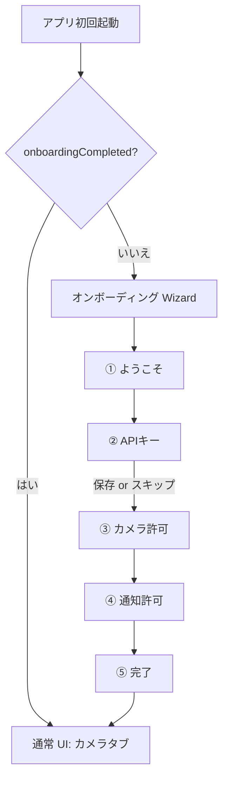

# Phase 7.1 初回オンボーディング — 実装計画

> **ステータス**: 実装済み（実機確認済み・2026-07-11）  
> **作成日**: 2026-07-11  
> **実装完了**: 2026-07-11  
> **親計画**: [`../IMPLEMENTATION_PLAN.md`](../IMPLEMENTATION_PLAN.md) §7.1

**ブラッシュアップ**: UI/UX の細かい改善（レイアウト、文言、アニメーション、ステップインジケータ等）は **意図的に後回し**。Phase 5.2 以降の優先タスクを先に進める。

---

## 1. 背景と目標

### 解決したいこと

| ギャップ | 現状 | 目標 |
|----------|------|------|
| APIキー入力 | 設定タブを自分で見つける | 初回に「何が必要か」を説明し入力 or スキップ |
| カメラ権限 | カメラタブ表示時に **無説明で** システムダイアログ | 用途を説明してから許可を求める |
| 通知権限 | 未許可時は通知が **黙って出ない** のみ | 解析完了通知のため許可を案内（API 33+） |
| 設定タブの存在 | 7.3 は送信時に初めて気づく | オンボーディングで設定の役割を一度示す |

### スコープ外（意図的にやらない）

- 長いチュートリアル・操作デモ動画
- Google Drive / クラウド連携の説明（7.2' で廃止済み）
- APIキー未設定での **永久ブロック**（撮影自体は可能。解析は 7.3 ガード）
- オンボーディングの再表示 UI（設定から「最初からやり直す」）
- 通知履歴永続化（Phase 2.5）

### 完了条件

- [x] 新規インストール（アプリデータ削除含む）後、**1回限り**のウィザードが表示される
- [x] ウィザードを完了すると通常のカメラ起動フローに入れる
- [x] APIキー・カメラ・通知それぞれについて **なぜ必要か** が画面に書いてある
- [x] APIキーをスキップしてもアプリは使えるが、カメラタブで **未設定が分かる**（バナー等）
- [x] 要件 `REQUIREMENTS.md` §14 と整合する

---

## 2. ユーザーフロー（案）



### 各ステップ（最小構成）

| # | 画面 | 主アクション | スキップ |
|---|------|-------------|----------|
| 1 | **ようこそ** | 次へ | なし |
| 2 | **APIキー** | 入力して保存 / あとで | スキップ可（警告文表示） |
| 3 | **カメラ** | 許可する → システムダイアログ | 既に許可済みなら自動で次へ |
| 4 | **通知** | 許可する（API 33+ のみ表示） | API 32 以下はステップ省略 |
| 5 | **完了** | はじめる | なし |

### 任意（7.1.3 — 優先度低）

| # | 画面 | 内容 |
|---|------|------|
| 4.5 or 5 の前 | **バックアップのひとこと** | 「月1回、設定から JSON エクスポートを推奨」（1段落 + 次へ） |

**初回版は 5 ステップのみ**とし、バックアップ案内は完了画面の1行テキストに留めてもよい。

---

## 3. 既存資産の再利用

| 資産 | パス | 再利用方針 |
|------|------|------------|
| APIキー保管 | `GeminiApiKeyStore.kt` | そのまま `saveKey()` / `hasKey()` |
| 未設定文言 | `MISSING_KEY_USER_MESSAGE` | スキップ警告・バナー・7.3 ダイアログで統一 |
| 送信時ガード | `MainActivity.confirmPreviewOrShowApiKeyDialog` | **変更なし**（オンボーディング後の二重防御） |
| カメラ権限 | `CameraPermission.kt` | オンボーディング後は現行どおり。Wizard 内は別ランチャー |
| 設定の APIキー UI | `SettingsScreen.kt` | **共通化候補**（後述） |
| 通知チェック | `AnalysisNotifications.notify` | 許可未取得時は return のみ（現状） |

---

## 4. 新規追加するもの

### 4.1 `OnboardingPrefs`（新規）

**パス案**: `app/.../data/prefs/OnboardingPrefs.kt`

| キー | 型 | 用途 |
|------|-----|------|
| `onboarding_completed` | Boolean | ウィザード完了フラグ |

- 実装: `SharedPreferences`（`FileBackupPrefs` と同様。DataStore 依存は増やさない）
- アプリデータ削除でリセット → 再表示（期待どおり）

### 4.2 `OnboardingWizard`（新規）

**パス案**: `app/.../ui/onboarding/OnboardingWizard.kt`

- 全画面オーバーレイ（Material3 `Scaffold` + ステップインジケータは任意）
- `enum class OnboardingStep { Welcome, ApiKey, Camera, Notification, Done }`
- 戻るボタン: APIキー以降で許可（Welcome では不可）
- 完了時: `OnboardingPrefs.setCompleted(true)` + `onFinished()` コールバック

### 4.3 ステップ用 Composable（新規）

| ファイル | 内容 |
|----------|------|
| `OnboardingWelcomeStep.kt` | タイトル + アプリの一行説明 |
| `OnboardingApiKeyStep.kt` | 入力欄 + 保存 + スキップ |
| `OnboardingCameraStep.kt` | 説明文 + 「許可する」ボタン |
| `OnboardingNotificationStep.kt` | 説明文 + 「許可する」（API 33+ のみ） |
| `OnboardingDoneStep.kt` | 完了 + 「はじめる」 |

または **1ファイルにまとめてよい**（ステップ数が少ないため）。

### 4.4 APIキー入力の共通化（推奨）

**パス案**: `app/.../ui/settings/GeminiApiKeyInputSection.kt`

`SettingsScreen` と `OnboardingApiKeyStep` から呼ぶ共通 Composable:

- `OutlinedTextField` + 保存ボタン
- 上書き確認ダイアログ（設定側のみ、または両方）

オンボーディング側は **疎通テスト・削除ボタンは不要**。

### 4.5 カメラタブの APIキー未設定バナー（7.1.2）

**パス案**: `CameraScreen` または `MainActivity` のカメラ composable 上

```
[!] Gemini APIキーが未設定です。解析するには設定で入力してください。 [設定へ]
```

- 表示条件: `onboardingCompleted && !apiKeyStore.hasKey()`
- タップで設定タブへ（`navigateToTabRoot(Route.Settings)`）
- 撮影自体はブロックしない

### 4.6 権限リクエストの整理

| 権限 | 現状 | 変更 |
|------|------|------|
| `CAMERA` | `CameraPermission` がタブ表示時に即 `launcher.launch` | オンボーディング中は Wizard で説明後にリクエスト。完了後は `autoRequest` フラグで制御 |
| `POST_NOTIFICATIONS` | リクエスト UI なし | Wizard で説明 + `RequestPermission`（API 33+） |

**パス案**: `CameraPermission.kt` に `autoRequest: Boolean = true` を追加  
オンボーディング未完了かつ Wizard 外では、カメラタブで従来どおり自動リクエストしてよい。

---

## 5. 既存ファイルの変更

| パス | 変更内容 |
|------|----------|
| `MainActivity.kt` | `!onboardingCompleted` 時は `OnboardingWizard` を表示。通知 deep link 時の例外（§6） |
| `CameraPermission.kt` | `autoRequest` パラメータ追加 |
| `SettingsScreen.kt` | APIキー欄を共通化 Composable に抽出（任意だが推奨） |
| `CameraScreen.kt` | APIキー未設定バナー（7.1.2） |

**変更不要（触らない）**

- `AnalysisWorker.kt`, `GeminiApiKeyStore.kt` の 7.3 ロジック
- バックアップ関連
- `AndroidManifest.xml`（権限宣言は既に十分）

---

## 6. エッジケースと方針

| ケース | 方針 |
|--------|------|
| 通知タップで初回起動（`EXTRA_RECEIPT_ID` あり） | **オンボーディングをスキップ**し詳細へ。初回は稀なため |
| APIキー スキップ | Wizard 続行。完了後はカメラバナー + 7.3 ダイアログ |
| カメラ拒否 | 「設定から許可できます」と表示。Wizard は完了可能。カメラタブは現行の拒否 UI |
| 通知拒否 | Wizard は完了可能。解析通知は出ない（現状と同じ） |
| オンボーディング途中でアプリ終了 | 再起動時に **最初から**（`onboardingCompleted` は未設定のまま） |
| 既存ユーザー（アップデート） | `onboardingCompleted` デフォルト false → **一度 Wizard が出る**。嫌ならマイグレーションで true 初期化を検討（**初版は出してよい**。個人利用） |

### 既存ユーザーへの Wizard 表示

アップデート直後に全員に出るのがうざい場合のみ、初回起動時:

```kotlin
// 初版は省略可。要望があれば:
if (hasExistingReceipts || apiKeyStore.hasKey()) {
    onboardingPrefs.setCompleted(true)
}
```

**推奨**: 個人利用・データ少数なら **シンプルに全員1回表示** でよい。

---

## 7. 文言方針（案）

### ようこそ

> レシートを撮るだけで家計簿がつきます。  
> 最初に、解析と撮影に必要な設定をします。

### APIキー（スキップ時）

> `GeminiApiKeyStore.MISSING_KEY_USER_MESSAGE` と同系統の警告 + 「あとで設定できます」

### カメラ

> レシートを撮影するためにカメラの使用を許可してください。

### 通知

> 解析が終わったらお知らせします。通知を許可してください。

### 完了

> 準備完了です。レシートを撮影して送信してください。  
> （任意）データのバックアップは設定から JSON で保存できます。

---

## 8. 実装フェーズ

### Phase A — 骨格（0.5日）

1. `OnboardingPrefs`
2. `OnboardingWizard` シェル + Welcome / Done のみ
3. `MainActivity` でゲート
4. 完了後に通常 UI 表示

**出口**: 初回だけ Welcome → Done → カメラ。2回目以降は出ない。

### Phase B — APIキー（0.5日）

1. `OnboardingApiKeyStep` + `GeminiApiKeyInputSection` 抽出
2. スキップ + 警告
3. `SettingsScreen` を共通化 Composable に寄せる

### Phase C — 権限（0.5日）

1. `OnboardingCameraStep` + 権限ランチャー
2. `OnboardingNotificationStep`（API 33+ 分岐）
3. `CameraPermission.autoRequest` 調整

### Phase D — 常時ガード（0.25日）

1. カメラタブ APIキー未設定バナー
2. 設定タブへの導線

### Phase E — ドキュメント・実機（0.25日）

1. `REQUIREMENTS.md` にオンボーディング § 追加
2. `KNOWN_ISSUES.md` §1 を解決済みに
3. [`IMPLEMENTATION_PLAN.md`](../IMPLEMENTATION_PLAN.md) の 7.1 チェック更新
4. 実機: データ削除 → Wizard 一通り → 撮影 → 解析

---

## 9. 完了条件チェックリスト

- [x] `OnboardingPrefs` で完了フラグが永続化される
- [x] 初回のみ Wizard が表示される
- [x] APIキーをオンボーディング内で保存できる
- [x] APIキースキップ後、カメラバナーと 7.3 ダイアログが機能する
- [x] カメラ・通知の許可フローに説明画面がある
- [x] Wizard 完了後、起動=カメラの既存 UX が維持される
- [x] 通知 deep link 起動で Wizard が邪魔しない
- [x] `REQUIREMENTS.md` / `KNOWN_ISSUES.md` が更新されている

---

## 10. テスト手順（実機）

1. アプリデータ削除 → 起動 → Wizard 表示
2. APIキー入力 → 保存 → 完了まで進む → カメラが開く
3. 再度データ削除 → APIキー **スキップ** → カメラバナー表示 → 撮影 → 送信で 7.3 ダイアログ
4. データ削除 → カメラ/通知を **拒否** しても Wizard 完了できること
5. Wizard 完了後、再起動で Wizard が出ないこと
6. （任意）解析完了通知が許可後に出ること

---

## 11. リスクと対策

| リスク | 対策 |
|--------|------|
| Wizard がカメラ起動を遅らせる | ステップ数を5に抑える。完了まで NavHost を出さない |
| 設定 UI と APIキー入力の二重管理 | `GeminiApiKeyInputSection` に集約 |
| アップデートユーザーに Wizard が出る | 個人利用なら許容。必要なら既存データ検出でスキップ |
| オンボーディングと `requireCameraPermission` の二重リクエスト | オンボーディング完了後のみカメラタブで autoRequest |

---

## 12. 次の作業（本計画の後）

1. ~~Phase A〜D 実装~~ ✅（2026-07-11）
2. ~~実機スモーク~~ ✅（2026-07-11）
3. **ブラッシュアップ** — Phase 8（[`phase-8-polish.md`](phase-8-polish.md)）: 8.1 JSON → 8.3 M1/M2 → 8.2 UI
4. ~~Phase 5.2（解析状態の可視化統一）~~ ✅ 完了

---

## 13. コード精査メモ（2026-07-11・Phase 8 で一部解消）

Phase 7.1 実装後の精査。**クリティカルな問題はなし**。M1/M2 は Phase 8.3 で解消（2026-07-12 実機確認済み）。

### 中程度 — ✅ Phase 8.3 で解消

| # | 項目 | 状態 |
|---|------|------|
| M1 | 権限状態が設定アプリ復帰後に古い | ✅ `ON_RESUME` で再評価 |
| M2 | 許可時に `onNext()` が二重呼び出しされうる | ✅ `LaunchedEffect` のみで自動遷移 |

### 低優先（ブラッシュアップ時）

| # | 項目 | 内容 | 状態 |
|---|------|------|------|
| L1 | 画面回転で Wizard ステップがリセット | `rememberSaveable` 化 | ✅ Phase 8 |
| L2 | 「準備完了」画面でアプリ終了すると未完了扱い | `onboarding_completed` は「はじめる」押下時のみ `true` | 意図どおり |
| L3 | アップデートユーザー全員に Wizard が1回出る | 計画どおり | 意図どおり |
| L4 | 上書き確認ダイアログの重複 | `OnboardingWizard` と `GeminiApiKeyInputSection` | 未着手 |
| L5 | `showOnboarding` が起動時 prefs のみ参照 | 通常は問題にならない | 意図どおり |
| L6 | オンボーディング拒否後、カメラタブで即再リクエスト | `requireCameraPermission(autoRequest=true)` | 未着手 |
| L7 | `GeminiApiKeyStore.saveKey("")` 防御 | Store 側ガード | ✅ Phase 8 |

### 確認済み（問題なし・意図どおり）

- deep link 起動時の Wizard スキップ（`deepLinkReceiptId` は `onCreate` で同期セット）
- `OnboardingPrefs` の `applicationContext` 利用
- カメラバナーは Wizard ゲートにより実質 `onboarding 完了後 && !hasKey()`
- APIキー未設定の多層防御（Wizard → バナー → 7.3 ダイアログ → Worker `FAILED`）
- `autoSkippedCamera/Notification` による戻る操作後のループ回避

---

## 参照

- [`../IMPLEMENTATION_PLAN.md`](../IMPLEMENTATION_PLAN.md)
- [`KNOWN_ISSUES.md`](KNOWN_ISSUES.md) §1
- [`REQUIREMENTS.md`](REQUIREMENTS.md) §3, §10, 実装ギャップ表
- [`backup-manual-migration.md`](backup-manual-migration.md) — バックアップ案内の参照先
